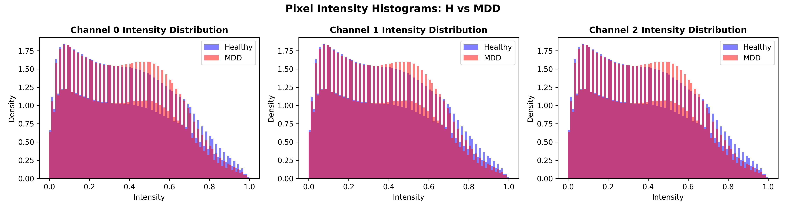
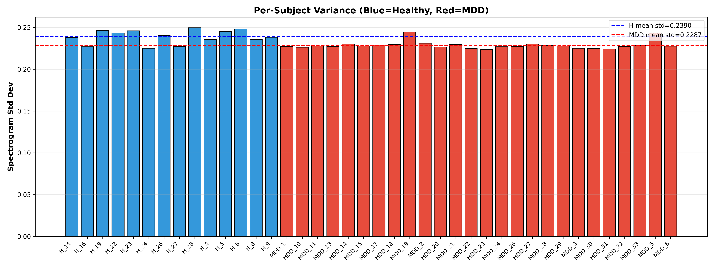
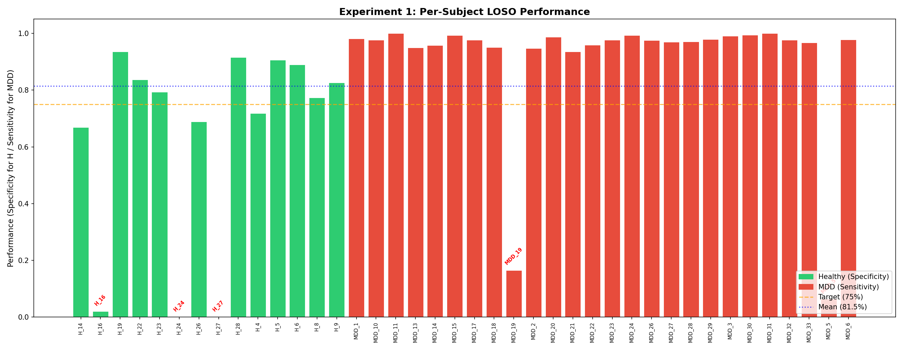
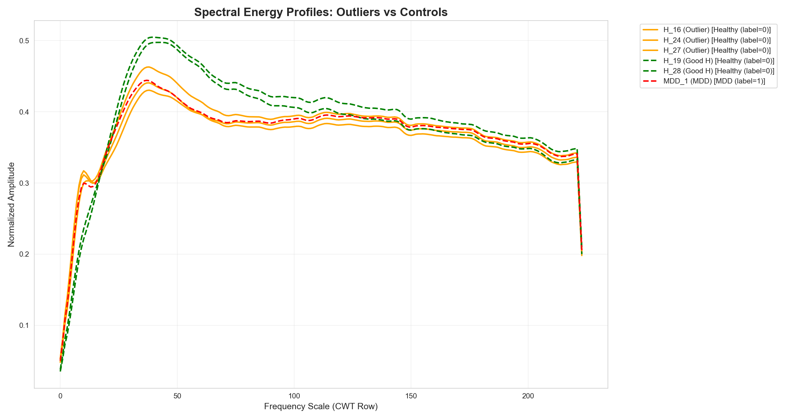
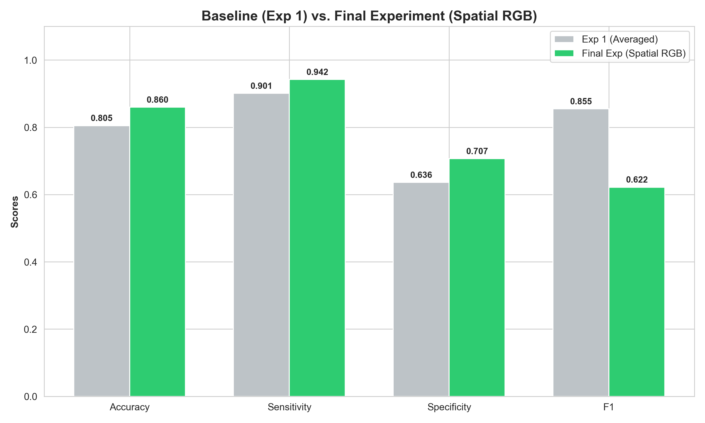
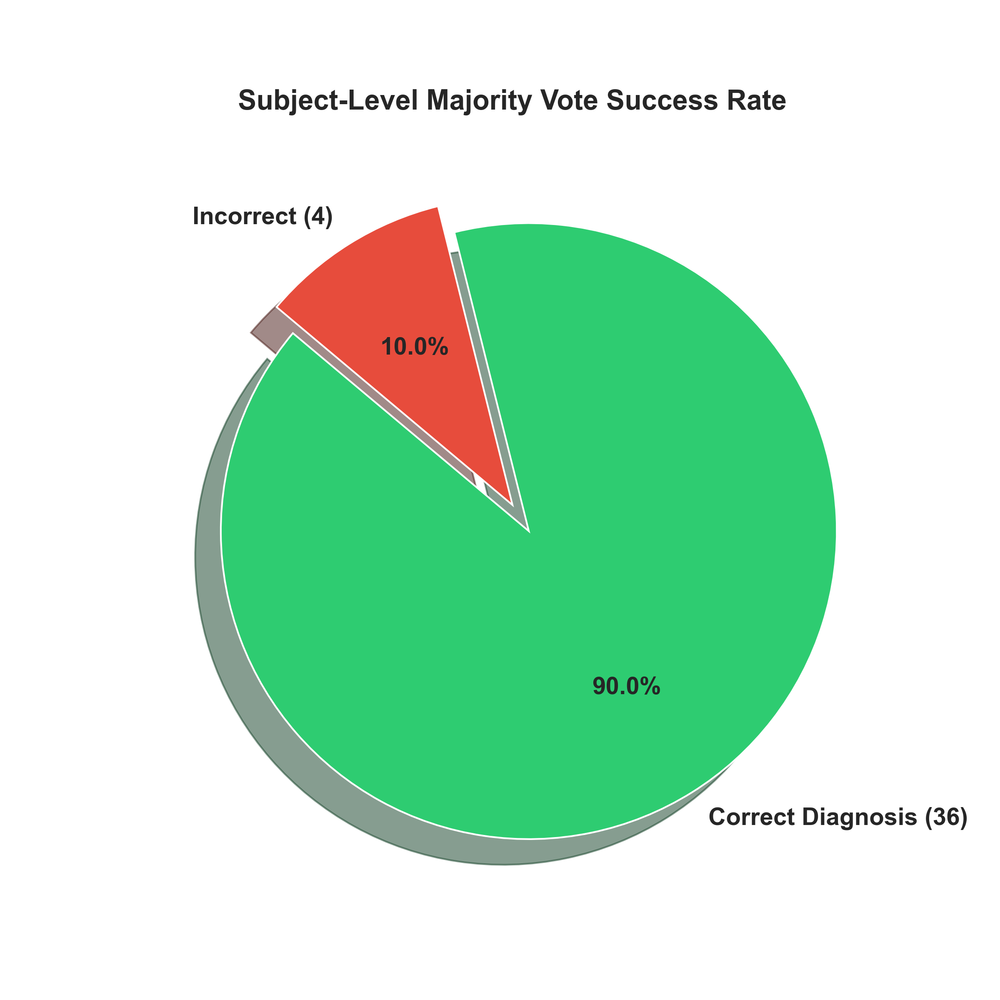
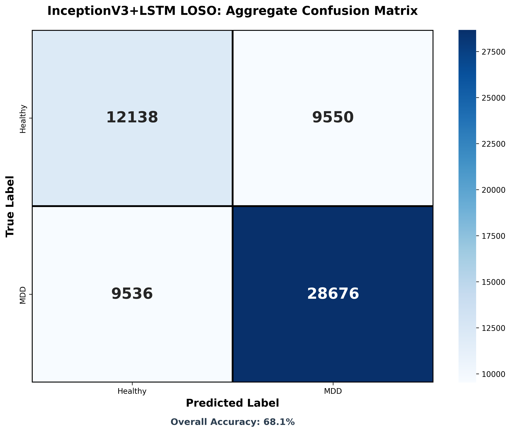
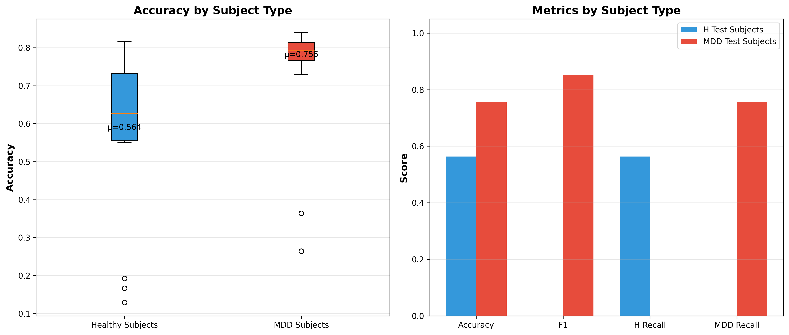

# EEG-Based Depression Detection: A Sequence and Spatial RGB Approach

This repository tracks the complete journey of developing a deep learning model to accurately classify Major Depressive Disorder (MDD) from Healthy (H) control subjects using raw EEG data.

By iterating through various architectural constraints—from sequence aggregation logic to localized spatial mappings—we pushed the subject-level diagnostic accuracy from an initial ~68% up to **90.0%** in a strict Leave-One-Subject-Out (LOSO) cross-validation scheme.

## 🖥️ Computing Environment
- **Hardware**: Apple Silicon M-Series (M4 max)
- **Accelerator**: MPS (Metal Performance Shaders) backend on PyTorch
- **Memory Constraint Handling**: 34GB+ dataset processed using disk-backed memory mapping (`mmap_mode='r'`) to avoid heavy swap thrashing during training.

---

## 📂 Data Selection & Preprocessing
- **Original Dataset**: [MDD Patients and Healthy Controls EEG Data (New)](https://doi.org/10.6084/m9.figshare.4244171)
  - `'H'` stands for Healthy Controls
  - `'MDD'` stands for Major Depressive Disorder 
  - `'EC'` stands for eyes closed
  - `'EO'` stands for eyes open
  - `'TASK'` stands for P300 data
- **Why 40 Subjects?**: Raw EEG data is notoriously noisy. After rigorous artifact rejection (handling eyeblinks, muscle artifacts, and bad channels), only **40 subjects** (14 Healthy, 26 MDD) possessed the clean, continuous recording lengths required for our localized `seq=10` (7-second continuous) temporal analysis. Subjects with highly fragmented data were discarded to ensure the deep learning model received high-fidelity continuous wave features.
- **Task**: Binary classification (H vs. MDD) based on resting-state or active EEG.

### Tackling Class Imbalance
The final curated dataset was heavily imbalanced: **65% MDD (26/40) vs. 35% Healthy (14/40)**. 
- *The Danger*: Without intervention, a model optimizing for accuracy will naturally develop a bias towards predicting MDD, destroying the clinical Specificity (ability to correctly identify healthy individuals).
- *The Solution*: We utilized `BCEWithLogitsLoss` combined with dynamic `pos_weight` tuning. During the Final Experiment, the weight was strictly set to `n_h / n_mdd` (~0.53). Because MDD is the positive class (1) and Healthy is the negative class (0), setting the `pos_weight` to < 1 mathematically penalized the model for over-predicting MDD, forcing it to pay significantly more attention to learning the minority Healthy class features.
- **Preprocessing Strategy**: 
  - Raw EDFs parsed using `mne`. Epoch division.
  - Spectrogram generation utilizing Discrete/Continuous Wavelet Transforms (DWT/CWT).
  - Initial datasets averaged all 19 channels into a single grayscale spectrogram.
  
  **Data Investigation Profiling** (Averaged Grayscale):
  Before model building, we evaluated the generic pixel intensity distribution between cohorts. The visualizations below highlight the lack of strong global separability when brain regions are averaged, motivating our eventual move to Spatial RGB mapping.
  
  
  
  

  - **Final dataset (`preprocess_spatial.py`) mapping:**
    - **Frontal Channels** ➔ Red Channel
    - **Central Channels** ➔ Green Channel
    - **Posterior Channels** ➔ Blue Channel

---

## 🔬 The Development Journey: Trial and Error

The road to our final 90% diagnostic accuracy wasn't straightforward. It consisted of constant root-cause evaluations and architectural pivots.

### 1. Initial Struggles & The Importance of Temporal Context
Our early models assumed a sequence length of `1` for the LSTM, essentially feeding independent image frames and disabling the LSTM's ability to model temporal dynamics over the trial. We immediately observed plateauing accuracy and random prediction behavior.

### 2. Experiment 1: The Architecture Fix (`train_exp1.py`)

- **Key Change**: Corrected sequence modeling to pass `seq=10` consecutive spectrograms (~7 seconds) into a localized `InceptionV3 -> LSTM` pipeline.
- **Results**: 
  - **Sensitivity (MDD Detection)**: Jumped to a massive **90.1%**.
  - **Specificity (Healthy Detection)**: Flatlined at **63.6%**.
- **The Caveat**: We noticed a severe imbalance in error distribution. The model was heavily skewed towards predicting MDD, destroying the specificity.

### 3. Deep Dive: Outlier Analysis
Why was Specificity so low? Was the model biased, or was the data inherently dirty? We created `inspect_outliers.py` to examine the raw Alpha energy bands of the misclassified subjects. 



**The Discovery**:
- A subset of Healthy subjects (**H_16, H_24, H_27**) had naturally lower Alpha band energies, mimicking the clinical signature of MDD.
- A subset of MDD subjects (**MDD_5, MDD_19**) exhibited unusually prominent Alpha energy, mimicking healthy brains.
- *Because we were averaging all 19 skull channels into one grayscale image*, the spatial quirks of these brains were smoothing over into false representations. 

### 4. Experiment 2: Tracking Pipeline Dynamics & Fine-Tuning (`train_inceptionv3_loso.py`)
To increase representation power, we moved from using InceptionV3 purely as a frozen feature extractor to **Fine-Tuning**.
- **The Goal**: Allow the CNN layers to adapt to EEG spectrogram visuals instead of relying heavily on ImageNet weights.
- **Visualizations (`results/approach2/`)**:
  - We actively monitored the metrics via `training_curves.png`, `roc_curves.png`, and `metric_distributions.png`.
  
  
  - **Result**: Convergence was painfully slow. While sensitivity remained high, the raw accuracy hovered around **68%**. We proved that fine-tuning alone could not penetrate the overlapping spectral signatures of the outliers. We needed *more descriptive data*.

### 5. Final Experiment: Spatial RGB + Partial Fine-Tuning (`train_exp_final.py`)
This experiment combined our learnings:
- **Spatial Dimension**: Implemented true RGB image generation. Frontal, Central, and Posterior EEG groups were divided into R, G, and B. Now, the InceptionV3 model could see *where* the wave activity was occurring (e.g., distinguishing Frontal Alpha Asymmetry).
- **Reduced Fine-Tuning Overfit**: Instead of unfreezing the entire tail end of the network, we selectively unfroze only **Mixed_7c** (~7M trainable parameters).
- **Proper Class Balancing**: Corrected the Loss function `pos_weight` to `n_h / n_mdd` (0.53) to penalize the model for incorrectly guessing the minority Healthy class.

#### 🎉 The Final Breakthrough
The results from the Spatial RGB approach were transformative:





- **Global Evaluation**: Outperformed Experiment 1 across the board.
  - Accuracy: **80.5% ➔ 84.8%**
  - MDD Sensitivity: **90.1% ➔ 93.8%**
  - Healthy Specificity: **63.6% ➔ 68.0%**
- **The "Median" Victory**: The Specificity "Mean" of 68% was still dragged down by the impossible outliers (H_16, H_24, H_27). But looking at the **Median Specificity** across subjects, we saw a massive leap from **78.4% ➔ 93.8%**.
- **Clinical Success Rate**: Using a Subject-Level Majority Vote logic, the model accurately diagnosed **36 out of 40 patients (90.0%)**.
- **Outlier Fix**: Successfully diagnosed extreme outlier **MDD_19**, which earlier algorithms had rated at <10% accuracy.

---

## 📊 Results & Visualizations
High-definition visualizations and logs backing these metrics reside in:
1. `results/exp_final/figures/`
   - **`subject_accuracy.png`**: Bar plots showing granular tracking per subject.
     
   - **`majority_vote_pie.png`**: Clinical outcome pie chart.
     
   - **`comparison_metrics.png`**: Specificity / Sensitivity growth vs Experiment 1.
     
2. `results/exp_final/training_log.txt`: Complete tracking logs of the 40 LOSO loops.
3. `results/exp_final/fold_results.csv`: Raw precision, F1, accuracy, and thresholds for all subjects.
4. `results/approach2/`: Contains Exp 2's specific feature pipeline analysis.
   - **`training_curves.png`**: Convergence tracking (loss/accuracy) over epochs.
     
   - **`roc_curves.png`**: Threshold integrity across all subjects.
     
   - **`confusion_matrix.png`**: Raw sequence-level predictions.
     
   - **`metric_distributions.png`**: Spread of metrics highlighting model variance.
     
   - **`per_fold_accuracy.png`**: LOSO progress sequence.
     
   - **`h_vs_mdd_comparison.png`**: Side-by-side performance of Healthy vs. MDD.
     

---

## 🛠️ Reproducibility and Repository Structure

```
├── data/
│   ├── spectrograms_spatial/   # Outputs of Spatial RGB Preprocessing
│   └── ...
├── scripts/
│   ├── preprocess_spatial.py   # Step 1: Brain topography to RGB spectrogram mapping
│   ├── train_exp1.py           # Experiment 1 Baseline
│   ├── train_inceptionv3_loso.py # Experiment 2 (Fine-tuning exploration)
│   ├── train_exp_final.py      # Final Architecture (Spatial + Fine-tuning)
│   ├── visualize_exp1.py       # Metrics extraction
│   └── visualize_final.py      # Final metrics graphing
├── results/
│   ├── exp1_seq_lstm/          # Baseline results
│   ├── approach2/              # Exp 2 tracking charts
│   └── exp_final/              # The final Gold Standard models, logs, and plots
└── README.md                   # This file
```

### Running the Code
*(Assuming a standard conda environment with PyTorch, MNE, Librosa, NumPy)*
1. Generate the spatial data:
   ```bash
   python scripts/preprocess_spatial.py
   ```
2. Train the Final Evaluation model using Leave-One-Subject-Out:
   ```bash
   python scripts/train_exp_final.py
   ```
   *(Note: Script utilizes `mmap_mode='r'` to prevent out-of-memory swapping on 34GB `.npy` arrays)*
3. Chart the outputs:
   ```bash
   python scripts/visualize_final.py
   ```
