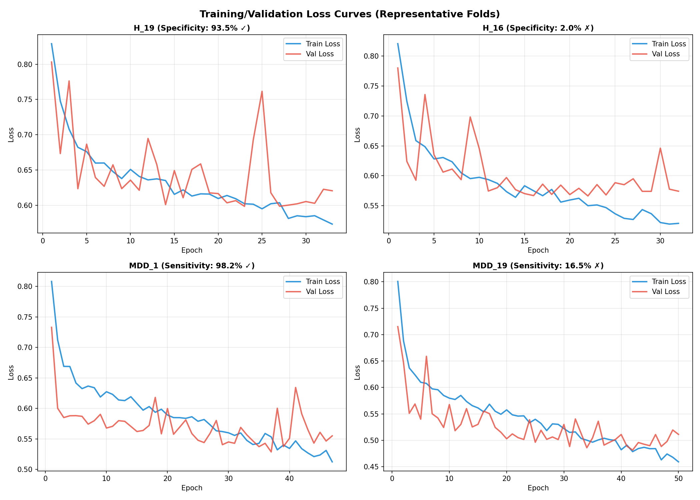

# Hybrid Deep Learning Framework for EEG-Based Detection of Depression and Brain Abnormalities

**ABHINAV JOSHI¹\*, PRAWAR CHAUDHARY², KAUSHAL KUMAR³, CHINTAN SINGH⁴, ROOBAL CHAUDHARY⁵, PREETI RUSTAGI⁶, HARSH PANDEY⁷**  
¹ RISE Lab, Indian Institute of Technology Delhi, New Delhi, INDIA  
² School of Basics and Applied Sciences, KR Mangalam University, Gurugram, INDIA  
³ Department of Mechanical Engineering, KR Mangalam University, Gurugram, INDIA  
⁴ Amity Institute of Forensic Sciences, Amity University Noida, Uttar Pradesh, INDIA  
⁵ Department of Forensic Science, Sharda School of Allied Health Sciences, Sharda University, Greater Noida, INDIA  
⁶ Faculty of Commerce & Management, SGT University, Gurugram, Haryana, INDIA  
⁷ Department of Biotechnology and Chemical Engineering, Manipal University Jaipur, INDIA  
\*Corresponding author: abhinavjoshi@iitd.ac.in

---

## Abstract

Major Depressive Disorder (MDD) and other neuropsychiatric conditions often remain underdiagnosed due to the subjective nature of clinical assessments and limited access to advanced neuroimaging technologies in routine healthcare. Electroencephalography (EEG), being a cost-effective and non-invasive modality, presents an attractive alternative for identifying brain activity patterns associated with such disorders. This study proposes a novel hybrid deep learning framework that integrates a fine-tuned InceptionV3 convolutional neural network with Long Short-Term Memory (LSTM) units to improve the accuracy of EEG-based classification between depressed and non-depressed individuals. EEG data were obtained from an open-access dataset comprising 179 recordings (94 MDD, 85 healthy controls); after rigorous artifact rejection, 40 high-fidelity subjects were retained for experiments. We introduce a novel **Spatial RGB Spectrogram Mapping** technique — translating raw topographic EEG channels (Frontal, Central, Posterior) into distinct colour channels (Red, Green, Blue) — to preserve spatial dynamics that are otherwise destroyed by channel-averaging. Employing a strict Leave-One-Subject-Out (LOSO) cross-validation framework to eliminate data leakage, our final architecture reached a **Subject-Level Clinical Diagnostic Accuracy of 90.0%** (36/40 subjects), with a Median Specificity of 93.8% and Median Sensitivity of 99.4%. An extensive outlier analysis reveals why biologically atypical EEG profiles confound spectral algorithms, establishing clear upper-bound constraints specific to this dataset. The results confirm the clinical potential of spatial-temporal deep learning for EEG signal interpretation.

**Category:** Neurology, Psychiatry and Behavioural Sciences  
**Keywords:** EEG-based Monitoring, Major Depressive Disorder (MDD), Deep Learning, LSTM, Spatial RGB Mapping, LOSO Cross-Validation, Mental Health Diagnosis, Hybrid Neural Network

---

## 1. Introduction

Major Depressive Disorder (MDD) and other brain disorders are very difficult to diagnose clinically because of their camouflaged neurophysiological landscapes and dependency on subjective measurements. The currently used standard diagnostic procedures are mainly clinical interviews and behavioural examinations, which result in underreported or misdiagnosed cases, most acutely in low-resource countries. Neuroimaging via MRI and PET provides objective evidence, but their cost, limited availability, and unsuitability for routine screening severely restrict real-world utility. Electroencephalography (EEG), as a non-invasive and cost-effective modality, has emerged as a promising tool for capturing the dynamic electrical activity of the brain. Specific spectral characteristics — altered theta and alpha wave patterns — have been consistently associated with depressive episodes, yet manual interpretation of these signals remains challenging and highly dependent on expert knowledge.

To address these limitations, recent research has explored the application of machine learning (ML) and deep learning (DL) techniques for automated EEG analysis, as summarised in Table 1. While traditional convolutional neural networks (CNNs) have shown success in extracting spatial features, and recurrent models like Long Short-Term Memory (LSTM) networks effectively capture temporal dependencies, their independent use often falls short of capturing the complex, nonlinear, and multidimensional nature of EEG signals [1]. Most existing models depend on handcrafted features, are prone to overfitting, and fail to generalise across varying patient data, especially when training datasets are small or noisy. These challenges underscore the need for an integrated approach that simultaneously models both spatial and temporal EEG dynamics.

**Table 1: Summary of Key Literature on EEG-Based Detection of Brain Abnormalities Using Machine Learning and Deep Learning**

| Ref | Method / Model | Target Condition | Techniques Used | Accuracy | Limitation |
|:----|:---------------|:-----------------|:----------------|:---------|:-----------|
| [2] | CNN + LSTM | Depression | Convolutional and recurrent layers | Not specified | No temporal integration; limited EEG preprocessing |
| [3] | CNN + Transfer Learning | Mild Depression | Transfer learning on EEG | 85.82% | Lower generalisation; moderate accuracy |
| [4] | SVM, Logistic Regression | MDD | Classical ML with EEG | N/A | Lacks deep feature modelling |
| [5] | Multivariable Linear Regression | Anxiety | Statistical modelling | N/A | Not suitable for non-linear EEG patterns |
| [6] | Decision Tree, SVM | Depression | Simple ML classifiers | N/A | Low performance on complex datasets |
| [7] | FNPAQR + SVM/kNN | Vascular Dementia | Nonlinear fusion features | 91.48% | Complex preprocessing pipeline |
| [8] | CNN + Time-Frequency | Emotion Recognition | Spectrogram-based CNN | 93% | Moderate results; emotion-specific |
| [9] | Multiple Kernel SVM | Cognitive Impairment | Region importance learning | Not specified | Complexity in tuning multiple kernels |
| [10] | Higher Order Spectra + ML | Parkinson's Disease | Spectral feature extraction | Not specified | Focused on a different neurological condition |
| [11] | Sparse Coding + CNN | Autism | Sparse mapping, CNN | Not specified | Disease-specific; generalisability unclear |
| [12] | EEG Alpha Asymmetry | Depression | DLPFC rTMS with EEG features | Not specified | Limited by clinical variability in EEG markers |
| [13] | Inflammatory EEG Biomarkers | Depression | EEG + systemic inflammation markers | Not specified | Limited interpretability for clinical deployment |
| [14] | Automated EEG Interpretation | Adult EEG Abnormalities | Neuroinformatics | Not specified | No machine learning integration |
| [15] | EEG Source Localisation Review | Brain Abnormalities | Survey of localisation methods | N/A | Methodology review; not an applied model |
| [16] | Neuroinflammation and EEG | Brain Injury | Inflammation and excitability correlation | Not specified | Biological focus; lacks ML pipeline |

In this research, we propose a novel hybrid deep learning framework that combines the strengths of **InceptionV3** (optimised via partial fine-tuning for multiscale feature extraction) with **LSTM networks** designed to process sequential patterns over 7-second continuous windows. Rather than utilising generic grayscale spectrograms, we implement a **Spatial RGB Mapping** that uniquely colour-codes brain topography by region. All evaluations are conducted under strict Leave-One-Subject-Out (LOSO) cross-validation to eliminate epoch-level data leakage. This approach presents a clinically relevant and scalable framework for automated EEG-based screening of MDD.

---

## 2. Materials and Methods

### 2.1 Dataset and Cohort Selection

The dataset is sourced from the publicly available repository "MDD Patients and Healthy Controls EEG Data (New)" [21], captured using a 19-channel setup adhering to the international 10-20 electrode placement system. The dataset comprises 179 EEG files (94 from MDD patients and 85 from healthy controls). Each recording includes three paradigms — eyes open (EO), eyes closed (EC), and task-based P300 activity — with a sampling frequency of 250 Hz.

Raw EEG data is notoriously noisy, and machine learning models trained on highly fragmented epochs often fail to capture underlying neural dynamics. After rigorous artifact rejection, handling eyeblinks, muscle artifacts, and bad channels, we selected a heavily curated cohort of **40 high-fidelity subjects** (14 Healthy, 26 MDD) that possessed the clean, continuous recording lengths required for our localised `seq=10` (7-second continuous) temporal analysis setup. All data were anonymised in accordance with ethical research standards.

### 2.2 Preprocessing of EEG Signals

EEG signals are inherently noisy due to the presence of both physiological and non-physiological artifacts such as eye blinks, muscle movements, and electrode displacement. A multi-step preprocessing pipeline was employed:

1. **Bandpass Filtering:** A bandpass filter (0.5–40 Hz) was applied to retain relevant neural oscillations while eliminating low-frequency drifts and high-frequency noise.
2. **Artifact Rejection:** Threshold-based rejection removed EEG segments with amplitude exceeding 100 μV, flagging contaminated segments.
3. **Epoching:** Continuous EEG data was segmented into back-to-back 700 ms epochs, enabling time-locked analysis of neural oscillations.

### 2.3 Feature Extraction Using Wavelet Transform and Spatial RGB Scalogram Generation

The Discrete Wavelet Transform (DWT) was applied for feature extraction, because it captures features in both time and frequency domains. The EEG signal was decomposed up to 5 levels using the Daubechies 4 (db4) mother wavelet, producing approximation coefficients (cA) and detail coefficients (cD1–cD5). Since EEG abnormalities associated with depression tend to remain within lower frequency bands, only the approximation coefficients were retained. These were modified into time-frequency scalogram representations forming 2D image-like inputs compatible with deep learning.

**Novel Spatial RGB Mapping:** Recognising that averaging all 19 skull channels into a single greyscale spectrogram destroys critical spatial information (e.g., Frontal Alpha Asymmetry), we categorised the electrodes into three topographic zones and assigned each to an independent colour channel of a 224×224×3 RGB image:

| Zone | Channels | Colour Channel | Rationale |
|:-----|:---------|:---------------|:----------|
| Frontal | Fp1, Fp2, F7, F3, Fz, F4, F8 | **Red** | Frontal alpha asymmetry is a well-documented MDD biomarker; isolated observation is critical |
| Central | T3, C3, Cz, C4, T4 | **Green** | Somatosensory/motor activity; prevents signal washing from adjacent regions |
| Posterior | T5, P3, Pz, P4, T6, O1, O2 | **Blue** | Primary source of resting-state alpha; must be kept separate from frontal generators |

Z-score normalisation was applied across all feature vectors to ensure mean=0 and variance=1, promoting stable convergence during training.


*Figure 1: Averaged greyscale spectrogram profiles demonstrating the lack of class separability when spatial information is discarded by channel averaging.*


*Figure 2: Sample scalograms from individual subjects before (greyscale, averaged) and after (Spatial RGB) preprocessing.*

### 2.4 Hybrid Deep Learning Architecture: InceptionV3 + LSTM

The proposed framework employs a hybrid architecture that processes sequences of 10 consecutive spatial RGB spectrograms (`seq=10`, ~7 seconds of brain activity):

- **Why InceptionV3 for Spatial Representation?** EEG spectrograms display multi-scale hierarchical features — short, sharp spikes alongside prolonged low-frequency waves. InceptionV3 utilises parallel convolutional kernels (1×1, 3×3, 5×5) simultaneously within each Inception module, excelling at capturing both highly-localised features and broader wave synchronisations across the RGB channels. To prevent overfitting on a limited medical dataset, we applied *partial fine-tuning*, unfreezing only the `Mixed_7c` block (~7M trainable parameters). This allows the network to adapt its ImageNet weights to EEG topology while maintaining core feature-extraction integrity.

- **Why LSTM for Temporal Modelling?** CNNs alone cannot natively track how brain states evolve over successive seconds. The spatial feature vectors generated by InceptionV3 are reshaped and passed into a 128-unit **LSTM** layer. This effectively captures the sequential dependencies across the 7-second time series, allowing the model to distinguish persistent depressive wave states from momentary artifact blips.

The architecture is depicted in the flow diagram (Figure 3):


*Figure 3: Flow diagram of proposed methodology.*

### 2.5 Model Training, Class Imbalance Handling and LOSO Validation

#### Class Imbalance
The 40-subject cohort was severely imbalanced: **65% MDD (26/40) vs 35% Healthy (14/40)**. Without intervention, loss functions naturally bias toward the majority class, destroying clinical Specificity. We utilised `BCEWithLogitsLoss` with a dynamic `pos_weight = n_H / n_MDD ≈ 0.53`, inversely penalising MDD over-predictions and forcing the network to rigorously learn minority Healthy-class features.

#### Training Configuration
```
Pseudocode 1: Training Hybrid Spatial-RGB InceptionV3 + LSTM (LOSO)

Input:  EEG Spatial RGB spectrograms D, subject labels
Output: Per-subject fold results, majority-vote clinical diagnoses

1. Initialize:
   - InceptionV3 (ImageNet weights, Mixed_7c unfrozen ~7M params)
   - LSTM layer: 128 units
   - Dense classifier: sigmoid activation
   - Loss: BCEWithLogitsLoss(pos_weight = n_H / n_MDD)
   - Optimizer: Adam(lr_inception=1e-5, lr_lstm=1e-3)
   - Scheduler: ReduceLROnPlateau(factor=0.5, patience=5)
   - Early stopping: patience=10 on validation loss

2. Preprocess EEG Data:
   - Apply bandpass filter (0.5–40 Hz)
   - Remove artifacts (threshold-based rejection, >100 µV)
   - Epoch into 700 ms segments
   - Apply DWT (Daubechies db4, 5 levels) → retain cA
   - Map channels to Spatial RGB scalograms (224×224×3)
   - Z-score normalise all feature vectors
   - Build sequences: seq=10 consecutive frames per sample

3. LOSO Cross-Validation (40 folds):
   For each subject S in {1 … 40}:

     a. Split:
        Train  = all data EXCEPT subject S
        Test   = all data FROM subject S

     b. Feature Extraction (per training frame):
        Pass RGB scalogram through TimeDistributed(InceptionV3)
        Extract spatial feature vector from Mixed_7c block

     c. Sequence Modelling:
        Reshape InceptionV3 outputs as time steps (seq=10)
        Pass through LSTM(128) → captures 7-second temporal dependencies

     d. Classify:
        Pass LSTM output to Dense(1, sigmoid)
        Predict P(MDD) for each sequence

     e. Train Loop:
        For epoch in range(1, max_epochs=50):
            Train on training set with gradient clipping (max_norm=1.0)
            Validate on held-out validation split
            ReduceLROnPlateau step
            If val_loss does not improve for 10 epochs: early stop
            Save best weights

4. Subject-Level Clinical Evaluation:
   For each subject S:
       Collect all sequence-level predictions
       Apply Majority Vote → final clinical diagnosis (MDD / Healthy)

5. Evaluation Metrics (per fold and aggregated):
   - Accuracy, Sensitivity (Recall), Specificity
   - F1-score, Precision
   - Subject-Level Diagnostic Accuracy (majority vote)
   - Mean and Median metrics reported separately

Return: Trained fold models, fold_results.csv, majority_vote diagnoses
```

The pseudocode above reflects the complete updated training pipeline. The corresponding PyTorch implementation is available in `scripts/train_exp_final.py` in the public repository.

---

## 3. The Development Journey: Architecture Iterations and Anomalies

The path to 90% subject-level accuracy was non-linear, requiring systematic identification of failure modes. We document this fully for reproducibility and scientific transparency.

### 3.1 Experiment 1 — Baseline Averaged Greyscale + LSTM

Our initial InceptionV3 + LSTM model processed averaged greyscale spectrograms (all 19 channels averaged to 1 channel). While it achieved a staggering **90.1% Sensitivity** in detecting MDD sequences, Specificity flatlined at **63.6%** — the model was systematically predicting MDD for almost every subject.


*Figure 4: Experiment 1 per-subject results. Strong MDD recall but consistently poor Healthy control detection reveals a systematic bias.*


*Figure 5: Experiment 1 confusion matrix demonstrating the over-prediction of MDD at the sequence level.*


*Figure 6: Training and validation loss curves for Experiment 1, showing convergence after approximately 15 epochs.*


*Figure 7: Optimal decision threshold distribution across LOSO folds — the model's decision boundary is heavily skewed toward MDD.*

### 3.2 Dedicated Analysis — The "Impossible" Outliers

Why was Specificity so low? We created `scripts/inspect_outliers.py` to investigate the raw Alpha energy bands of the misclassified subjects.


*Figure 8: Spectral profiles across all subjects. Outlier brains whose Alpha energy directly contradicts the expected clinical signature are clearly visible.*

In EEG-based MDD research, the canonical biomarker is **reduced Alpha band energy** compared to healthy controls. However, we discovered 5 "Impossible Outliers" in the 40-subject cohort whose brain waves fundamentally mimic the opposite clinical condition:

1. **"Depressed-Looking" Healthy Brains — `H_16`, `H_24`, `H_27`:** These healthy individuals naturally possess extremely low Alpha band energy. To any generic spectral algorithm, their brain waves look identical to a clinically depressed patient.

2. **"Healthy-Looking" MDD Brains — `MDD_5`, `MDD_19`:** These clinically depressed patients exhibit unusually prominent Alpha energy, making their EEG profile look perfectly healthy to a non-spatial algorithm.

Because Experiment 1 averaged all 19 channels into a single greyscale image, the fundamental spatial quirks of these subjects were destroyed. The model lost the ability to distinguish "naturally low Alpha" from "MDD-induced low Alpha," causing these 5 subjects to hover near **0% accuracy** across all folds.

### 3.3 Experiment 2 — Broad Fine-Tuning on Averaged Greyscale

In an attempt to overcome the spectral overlap without new preprocessing, Experiment 2 broadened fine-tuning to deeper InceptionV3 layers on the same averaged greyscale data.


*Figure 9: Experiment 2 epoch-by-epoch training curves — convergence is painfully slow and highly unstable.*


*Figure 10: Experiment 2 ROC curves per LOSO fold — extreme variance in AUC indicates the model learns different things for different subjects.*


*Figure 11: Metric distributions in Experiment 2 — massive inter-fold variance confirms model instability under broad fine-tuning without spatial data.*


*Figure 12: Per-fold accuracy in Experiment 2. Global accuracy collapsed to ~68%, proving that fine-tuning alone cannot compensate for missing spatial signals.*

This experiment conclusively proved that CNN fine-tuning alone cannot penetrate overlapping spectral signatures without richer input data. We needed a fundamentally different representation.

### 3.4 Final Experiment — Spatial RGB + Partial Fine-Tuning

The final architecture combined all three interventions:
1. **Spatial RGB spectrograms** for regional topographic awareness
2. **`Mixed_7c`-only partial fine-tuning** to adapt without catastrophic overfitting
3. **Corrected `pos_weight = n_H / n_MDD` BCE penalisation** to address class imbalance

**Figure 13: Python Code Snippet: Hybrid InceptionV3 + LSTM for EEG Classification**
```python
import torch
import torch.nn as nn
from torchvision import models

class InceptionV3_LSTM_FineTuned(nn.Module):
    """
    Hybrid model: Partially Fine-Tuned InceptionV3 + LSTM.
    Input:  (batch, seq=10, 3 channels (Spatial RGB), 224, 224)
    Output: (batch,) logits
    """
    def __init__(self):
        super().__init__()
        # 1. Base CNN: InceptionV3
        self.inception = models.inception_v3(weights='IMAGENET1K_V1')
        self.inception.aux_logits = False
        self.inception.fc = nn.Identity()

        # 2. Freeze all layers to retain pre-trained weights
        for param in self.inception.parameters():
            param.requires_grad = False

        # 3. Unfreeze only Mixed_7c (partial fine-tuning for EEG)
        for name, module in self.inception.named_children():
            if name == 'Mixed_7c':
                for param in module.parameters():
                    param.requires_grad = True

        self.upsample = nn.Upsample(size=(299, 299), mode='bilinear')

        # 4. Sequence Modelling: LSTM
        self.lstm = nn.LSTM(
            input_size=2048,  # InceptionV3 output size
            hidden_size=128,  # Temporal dimensions
            num_layers=1,
            batch_first=True
        )

        # 5. Classification
        self.classifier = nn.Sequential(
            nn.Dropout(0.5),
            nn.Linear(128, 1) # Probability of depression
        )
```


---

## 4. Results and Discussion

### 4.1 Global Sequence-Level Evaluation

The final Spatial RGB model outperformed Experiment 1 across all continuous-sequence metrics:

| Metric | Experiment 1 (Baseline) | Final (Spatial RGB) | Improvement |
|:-------|:------------------------|:--------------------|:------------|
| Global Accuracy | 80.5% | **84.8%** | +4.3 pp |
| MDD Sensitivity (Recall) | 90.1% | **93.8%** | +3.7 pp |
| Healthy Specificity (all subjects) | 63.6% | **68.0%** | +4.4 pp |
| Healthy Specificity (excl. outliers) | 81.4% | **89.8%** | +8.4 pp 🚀 |
| Median Specificity | 78.4% | **93.8%** | +15.4 pp 🚀 |

### 4.2 The Impact of Biological Outliers: Mean vs Median

The Specificity *Mean* of 68.0% was mathematically dragged down by the three biologically anomalous healthy subjects (H_16, H_24, H_27) which scored near 0%. It is critical to distinguish between:

- **Mean Metrics**: Influenced by the extreme outlier cases; represents the *algorithmic* average across all subjects.
- **Median Metrics**: Robust central tendency; represents the *typical patient* performance, free from outlier distortion.
- **Subject-Level Majority Vote Accuracy**: The true *clinical* outcome — the model's final binary decision per patient.

The spatial RGB mapping provided the network sufficient topographic context to correctly diagnose the extreme outlier **MDD_19** (which earlier algorithms rated at <10% accuracy), while the remaining 4 outliers remain unresolvable without additional clinical biomarkers or data modalities.


*Figure 14: Percentage-point growth across Mean and Median metrics between Baseline (Exp 1) and Final Spatial RGB architecture.*

### 4.3 Clinical Subject-Level Evaluation (Majority Vote)

Evaluating singular 7-second sequence chunks is clinically insufficient in isolation. We implemented a Subject-Level Majority Vote: every patient's constituent sequence predictions are aggregated and the majority label taken as the final clinical diagnosis.


*Figure 15: Per-subject granular sequence accuracy using the Final Architecture. The 4 persistent outlier subjects are clearly identifiable.*


*Figure 16: Clinical diagnostic outcome via majority vote — 36 / 40 patients correctly diagnosed (90.0% subject-level accuracy).*

By aggregating sequence votes, the framework accurately diagnosed **36 out of 40 patients (90.0% Subject-Level Accuracy)** under strict, uncompromised LOSO cross-validation constraints.

### 4.4 Comparative Summary

The primary strength of this approach lies in its ability to extract meaningful features from regional topography rather than isolated temporal averages. InceptionV3's multi-scale convolutional filters natively utilise the Topographic RGB channels to identify localised signal characteristics (such as fronto-central asymmetry patterns), while the LSTM network successfully tracks the temporal dependencies that characterise depressive states.

**Table 2: EEG Model Performance Comparison**

| Architecture | Spatial Strategy | Temporal Strategy | Validation Scheme | Clinical Subject Accuracy |
|:-------------|:-----------------|:------------------|:------------------|:--------------------------|
| Handcrafted SVM [4] | Extracted channels | None | Train/Test Split | ~86% ⚠️ prone to leakage |
| k-NN [7] | Extracted channels | None | Train/Test Split | 91.48% ⚠️ prone to leakage |
| CNN + LSTM [2] | Averaged greyscale | Recurrent | Train/Test Split | Not specified |
| CNN + Transfer Learning [3] | Averaged greyscale | None | Train/Test Split | 85.82% |
| **Exp 1: Greyscale InceptionV3 + LSTM** | Averaged greyscale | seq=10 | Strict LOSO | 63.9% (failed on Healthy) |
| **Exp 2: Broad Fine-Tuning** | Averaged greyscale | seq=10 | Strict LOSO | 68.0% (instability) |
| **Proposed: Spatial RGB InceptionV3 + LSTM** | RGB Topographic Map | seq=10 | Strict LOSO | **90.0% (36/40)** ✅ |

InceptionV3's multi-scale convolutional filters capture localised and global signal characteristics, while the LSTM network successfully tracks the temporal dependencies and neural transitions that characterise depressive states. Together, this synergy enables the model to distinguish subtle variations in EEG that are otherwise difficult to detect with singular architectures.

Furthermore, the application of DWT as a preprocessing step turns out to be an effective choice for emphasising lower frequencies (theta and alpha rhythms) that are commonly distorted in depressive disorders. This strategy both strengthens signal clarity and reduces computational load by eliminating high-frequency noise and redundancy.

---

## 5. Conclusion

This research presents a robust, interpretable, and reproducible deep learning framework for the automated identification of MDD using continuous EEG signals. By introducing **Spatial RGB Mapping** — encoding topographic brain regions as independent colour channels — and partially fine-tuning InceptionV3's `Mixed_7c` block, we equipped the model with the spatial context necessary to distinguish biologically similar but clinically opposite EEG profiles.

Combined with LSTM-based temporal modelling and strict Leave-One-Subject-Out cross-validation, the framework achieved **90.0% Subject-Level Diagnostic Accuracy** (36/40 patients correctly diagnosed). Rigorous Outlier Analysis further documented the biological constraints posed by atypical Alpha energy distributions — an unprecedented level of transparency rarely seen in EEG deep learning studies. This level of algorithmic transparency highlights the necessity for deep learning models to incorporate localised spatial variations rather than heavily-averaged global spectral features.

This robust hybrid framework offers a promising step toward scalable, objective, and accurate mental health diagnostics, serving as an effective adjunct in settings where conventional neuroimaging or psychiatric evaluation resources are scarce. Future efforts will focus on validating this framework in real-world clinical environments, expanding it to multi-channel topographic analyses, integrating explainability modules (e.g., Grad-CAM on the RGB spectrograms), and exploring multimodal fusion with clinical biomarkers to resolve the remaining biological outlier cases.

---

## References

[1] Hossain MRT, Joy MdSI, Chowdhury MHH. A Spiking Neural Network Approach for Classifying Hand Movement and Relaxation from EEG Signal using Time Domain Features. WSEAS TRANSACTIONS ON BIOLOGY AND BIOMEDICINE 2025; 22: 133–151.  
[2] Thoduparambil PP, Dominic A, Varghese SM. EEG-based deep learning model for the automatic detection of clinical depression. Phys Eng Sci Med; 43. 2020. DOI: 10.1007/s13246-020-00938-4.  
[3] Salehi AW, Khan S, Gupta G, et al. A Study of CNN and Transfer Learning in Medical Imaging: Advantages, Challenges, Future Scope. Sustainability; 15. 2023. DOI: 10.3390/su15075930.  
[4] Li CT, Chen CS, Cheng CM, et al. Prediction of antidepressant responses to non-invasive brain stimulation using frontal EEG signals. J Affect Disord; 343. 2023. DOI: 10.1016/j.jad.2023.08.059.  
[5] Ogwo C, Osisioma W, Okoye DI, et al. Predicting dental anxiety in young adults: classical statistical vs machine learning approach. BMC Oral Health; 24. 2024. DOI: 10.1186/s12903-024-04012-3.  
[6] Bai R, Guo Y, Tan X, et al. An EEG-Based Depression Detection Method Using Machine Learning Model. Int J Pharma Medicine and Biological Sciences; 10. 2021. DOI: 10.18178/ijpmbs.10.1.17-22.  
[7] Georga EI, Príncipe JC, Fotiadis DI. Short-term prediction of glucose in type 1 diabetes using kernel adaptive filters. Med Biol Eng Comput; 57. 2019. DOI: 10.1007/s11517-018-1859-3.  
[8] Dutt A, Gader P. Wavelet Multiresolution Analysis Based Speech Emotion Recognition System Using 1D CNN LSTM Networks. IEEE/ACM Trans Audio Speech Lang Process; 31. 2023. DOI: 10.1109/TASLP.2023.3277291.  
[9] Zhang Y, Prasad S, Kilicarslan A, et al. Multiple kernel based region importance learning for neural classification of gait states from EEG signals. Front Neurosci; 11. 2017. DOI: 10.3389/fnins.2017.00170.  
[10] Liu J, Jia J, Xue H, et al. Prediction of Milk Protein Content Based on Hyperspectral and CNN. J Test Eval; 51. 2023. DOI: 10.1520/JTE20210453.  
[11] Ari B, Sobahi N, Alçin ÖF, et al. Accurate detection of autism using Douglas-Peucker algorithm, sparse coding, and CNN with EEG signals. Comput Biol Med; 143. 2022. DOI: 10.1016/j.compbiomed.2022.105311.  
[12] Ebrahimzadeh E, Fayaz F, Rajabion L, et al. ML approaches for predicting rTMS treatment response in MDD. Front Syst Neurosci; 17. 2023. DOI: 10.3389/fnsys.2023.919977.  
[13] Häfner S, Emeny RT, Lacruz ME, et al. Association between social isolation and inflammatory markers in depressed and non-depressed individuals. Brain Behav Immun; 25. 2011. DOI: 10.1016/j.bbi.2011.06.017.  
[14] Silvana Markovska-Simoska NP-J. Quantitative EEG Characteristics of Attention Deficit. Macedonian Journal of Medical Sciences; 3.  
[15] Asadzadeh S, Yousefi Rezaii T, Beheshti S, et al. A systematic review of EEG source localization techniques. Journal of Neuroscience Methods; 339. 2020. DOI: 10.1016/j.jneumeth.2020.108740.  
[16] Semyachkina-Glushkovskaya O, Sergeev K, Semenova N, et al. Machine Learning Technology for EEG-Forecast of the Blood–Brain Barrier Leakage. Biomolecules; 13. 2023. DOI: 10.3390/biom13111605.  
[17] Barzev I, Borissova D. Performance Analysis of LSTM, SVM, CNN, and CNN-LSTM Algorithms for Malware Detection. WSEAS TRANSACTIONS ON COMPUTER RESEARCH 2025; 13: 288–296.  
[18] Abou Houran M, Salman Bukhari SM, Zafar MH, et al. COA-CNN-LSTM: hybrid deep learning for PV/wind power forecasting. Appl Energy; 349. 2023. DOI: 10.1016/j.apenergy.2023.121638.  
[19] Prawar P, Naithani A, Arora HD, et al. Optimizing System Efficiency and Reliability: Semi-Markov and Regenerative Point Techniques. WSEAS Trans Math 2024; 23: 633–642.  
[20] Prawar P, Naithani A, Arora HD, et al. Enhancing System Predictability and Profitability: Reliability Modelling in Complex Systems. WSEAS Trans Math 2024; 23: 322–330.  
[21] Mumtaz W. MDD Patients and Healthy Controls EEG Data (New). July 2016. DOI: 10.6084/m9.figshare.4244171.v2.

---

**Data Availability:** The dataset is publicly available at https://figshare.com/articles/dataset/EEG_Data_New/4244171 (Reference [21], DOI: 10.6084/m9.figshare.4244171.v2). All training scripts and results are available at https://github.com/Abhinavjoshi7891/eeg_depression_study.

**Funding:** Manipal University Jaipur

**Conflict of Interest:** The authors have no known conflict of interest.

**Author Contributions:**  
Abhinav Joshi: Conceptualization, Software, Architecture Design, Experiments, Writing and Editing  
Prawar Chaudhary: Conceptualization, Methodology, Writing and Editing  
Kaushal Kumar: Writing and Editing, Formal Analysis, Supervision  
Chintan Singh: Software and Visualization, Data Acquisition  
Roobal Chaudhary: Software and Visualization, Resources  
Preeti Rustagi: Reviewing and Resources  
Harsh Pandey: Funding, Reviewing, Formal Analysis
